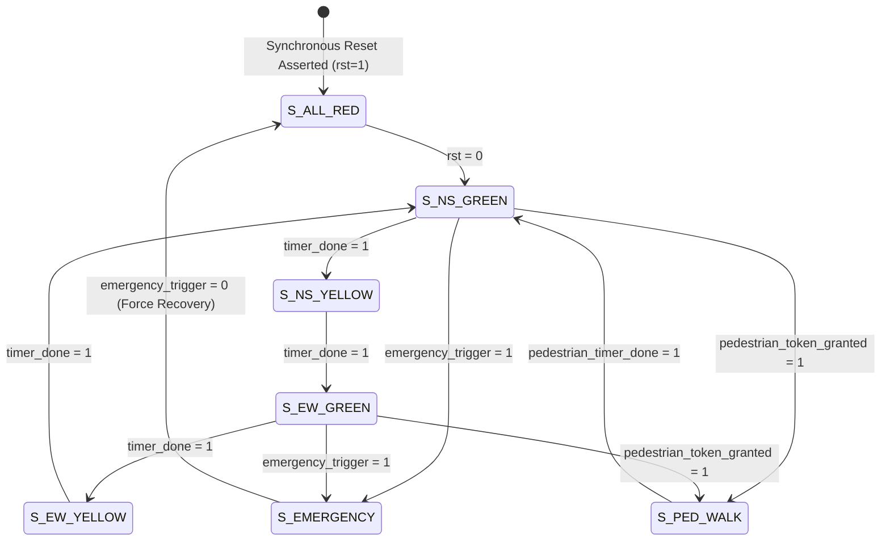

# Finite State Machine (FSM) Transition Diagram

```mermaid
stateDiagram-v2
    [*] --> S_ALL_RED : Synchronous Reset Asserted (rst=1)
    
    S_ALL_RED --> S_NS_GREEN : rst = 0
    
    S_NS_GREEN --> S_NS_YELLOW : timer_done = 1
    S_NS_YELLOW --> S_EW_GREEN : timer_done = 1
    S_EW_GREEN --> S_EW_YELLOW : timer_done = 1
    S_EW_YELLOW --> S_NS_GREEN : timer_done = 1

    %% Priority Preemption Paths
    S_NS_GREEN --> S_EMERGENCY : emergency_trigger = 1
    S_EW_GREEN --> S_EMERGENCY : emergency_trigger = 1
    S_NS_GREEN --> S_PED_WALK : pedestrian_token_granted = 1
    S_EW_GREEN --> S_PED_WALK : pedestrian_token_granted = 1

    %% State Recovery Paths
    S_EMERGENCY --> S_ALL_RED : emergency_trigger = 0 (Force Recovery)
    S_PED_WALK --> S_NS_GREEN : pedestrian_timer_done = 1
```
