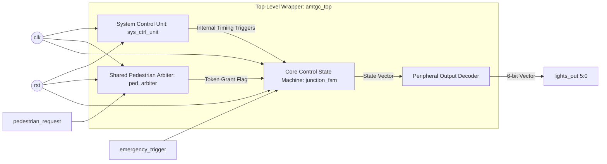

# AMTGC Top-Level Hardware Architecture Block Diagram

```mermaid
graph LR
    subgraph amtgc_top [Top-Level Wrapper: amtgc_top]
        direction LR
        sys_ctrl[System Control Unit: sys_ctrl_unit]
        ped_arb[Shared Pedestrian Arbiter: ped_arbiter]
        junc_fsm[Core Control State Machine: junction_fsm]
        decoder[Peripheral Output Decoder]
        
        sys_ctrl -->|Internal Timing Triggers| junc_fsm
        ped_arb -->|Token Grant Flag| junc_fsm
        junc_fsm -->|State Vector| decoder
    end

    %% External System Inputs
    clk((clk)) --> sys_ctrl
    clk --> ped_arb
    clk --> junc_fsm
    rst((rst)) --> sys_ctrl
    rst --> ped_arb
    rst --> junc_fsm
    
    emergency_trigger[emergency_trigger] --> junc_fsm
    pedestrian_request[pedestrian_request] --> ped_arb

    %% External System Outputs
    decoder -->|6-bit Vector| lights_out[lights_out 5:0]
```
